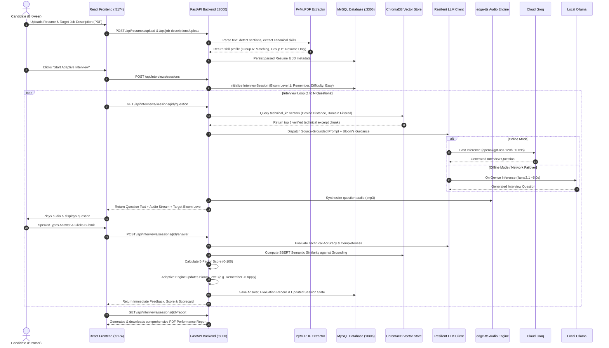

# SmartInterview: Master Review & Architectural Dossier
### *The Complete Project Defense & Technical Guide for Reviews and Viva Examination*

---

## 1. Project Identity & High-Level Overview

* **Project Title:** SmartInterview (AI-Powered Adaptive Mock Interview Platform)
* **Domain:** EdTech / Artificial Intelligence / Generative AI / Natural Language Processing
* **Lead Engineer:** Abhiram Konduri ([@konduriabhiram29-ai](https://github.com/konduriabhiram29-ai))
* **Primary Tech Stack:** Python 3.10+ (FastAPI), React 18 (Vite, Tailwind CSS v4), ChromaDB 0.6.3, SentenceTransformers (`all-MiniLM-L6-v2`), Groq Cloud LPUs (`openai/gpt-oss-120b`), Local Ollama (`llama3.1`), MySQL 8.0.

### The Core Problem Solved
Traditional technical interview preparation platforms suffer from three fundamental limitations:
1. **Static and Rigid Testing (LeetCode / HackerRank):** They test binary pass/fail unit tests for algorithms but cannot evaluate spoken prose, system design trade-offs, or conceptual communication.
2. **Resource-Heavy Human Mock Interviews (Pramp / Interviewing.io):** Expensive, difficult to schedule, and inconsistent in evaluation standards.
3. **Ungrounded Generative Chatbots (ChatGPT / Claude):** Unconstrained generic LLM bots frequently hallucinate facts, fail to adhere to pedagogical difficulty curves, and lack deterministic scoring rubrics.

### SmartInterview's Innovation
SmartInterview combines **Cognitive Scaffolding (Bloom's Taxonomy)** with **Domain-Filtered Vector RAG** and a **Resilient Dual-Engine (Cloud Groq + Local Offline Ollama)** to conduct grounded, human-like technical interviews with deterministic scoring.

---

## 2. Complete End-to-End System Workflow

The following sequence diagram details the exact life cycle of an interview session:



---

## 3. Directory Structure & File-by-File Breakdown

```text
SmartInterview-main/
├── backend/
│   ├── app/
│   │   ├── dependencies/
│   │   │   └── auth.py             # JWT bearer verification and database session injection
│   │   ├── models/
│   │   │   ├── user.py             # SQLAlchemy User model (email, password hash, role)
│   │   │   ├── resume.py           # Candidate resume & extracted technical skills
│   │   │   ├── job_description.py  # Target job description & required skills
│   │   │   └── interview.py        # Sessions, Questions, Answers, Evaluations
│   │   ├── routers/
│   │   │   ├── auth.py             # /api/auth: Registration, Login, Token generation
│   │   │   ├── resumes.py          # /api/resumes: PDF upload & skill extraction
│   │   │   ├── job_descriptions.py # /api/job-descriptions: JD parsing
│   │   │   ├── interviews.py       # /api/interviews: Active session orchestration
│   │   │   └── users.py            # /api/users: User profile & interview history
│   │   ├── schemas/
│   │   │   ├── auth.py             # Pydantic schemas for Login & Registration
│   │   │   ├── interview.py        # Schemas for question requests & answer submissions
│   │   │   └── report.py           # PDF report metadata schema
│   │   ├── services/
│   │   │   ├── bloom.py            # Bloom's Taxonomy definitions & transition rules
│   │   │   ├── llm_client.py       # Resilient LLM Client (Groq + Ollama with failover)
│   │   │   ├── question_service.py # Adaptive question synthesis & RAG prompt builder
│   │   │   ├── evaluation_service.py # 5-factor answer scoring engine
│   │   │   ├── syllabus_rag_service.py # Syllabus module extraction & temporary collections
│   │   │   ├── resume_service.py   # PyMuPDF section parsing & regex skill extraction
│   │   │   ├── jd_service.py       # Job description technical requirement parsing
│   │   │   ├── report_service.py   # ReportLab PDF generation for session scorecards
│   │   │   └── voice_service.py    # Microsoft edge-tts & Groq Whisper STT
│   │   ├── config.py               # Environment configuration loader (.env)
│   │   └── main.py                 # FastAPI application, CORS middleware, routes, health
│   ├── requirements.txt            # Python dependencies (FastAPI, ChromaDB, SBERT, Groq)
│   └── setup_database.sql          # MySQL database schema DDL script
├── frontend/
│   ├── src/
│   │   ├── components/
│   │   │   ├── Sidebar.jsx         # Navigation sidebar with responsive mobile drawer
│   │   │   ├── Header.jsx          # User profile status & notification badge
│   │   │   └── ScoreCard.jsx       # Visual breakdown of 5-factor evaluation
│   │   ├── context/
│   │   │   └── AuthContext.jsx     # Authentication state, login/logout, JWT persistence
│   │   ├── pages/
│   │   │   ├── Login.jsx           # User sign-in interface
│   │   │   ├── Register.jsx        # Account registration
│   │   │   ├── Dashboard.jsx       # Performance metrics & session history
│   │   │   ├── ResumeUpload.jsx    # Candidate resume dropzone & skill preview
│   │   │   ├── JDUpload.jsx        # Target Job Description upload & role mapping
│   │   │   ├── SyllabusUpload.jsx  # Academic course document ingestion (Syllabus Mode)
│   │   │   ├── InterviewSetup.jsx  # Skill selection & difficulty mode configuration
│   │   │   └── Interview.jsx       # Real-time interview room with speech synthesis
│   │   ├── api/                    # Axios REST client configuration
│   │   └── App.jsx                 # React Router routing table
│   ├── vite.config.js              # Vite dev server with reverse proxy for /api -> :8000
│   └── package.json                # React, Tailwind CSS, Lucide React dependencies
├── chroma_db/                      # Local ChromaDB persistent vector database (402 CS chunks)
├── data/
│   ├── processed/                  # Curated 50 concepts across 8 CS domains
│   └── knowledge_stats.json        # Canonical stats (402 chunks, 50 concepts, dynamic tracking)
├── scripts/
│   ├── generate_question.py        # Standalone CLI mock interview runner
│   ├── ingest_vector_db.py         # Batch vector embedding ingestion tool
│   └── verify_deliverables_sync.py # Deliverables synchronization & coherence validator
├── SmartInterview_Deliverables/     # Frozen baseline academic deliverables (DO NOT EDIT)
├── SmartInterview_Progressive_Updates/ # Active progressive versions (SRS, PPT, Research Paper)
├── .env.example                    # Template environment variables
├── .gitignore                      # Git exclusion rules (protects .env and scratch files)
└── README.md                       # Comprehensive repository documentation
```

---

## 4. Algorithmic Deep-Dive

### A. Bloom's Taxonomy Adaptive State Machine
Unlike standard bots that ask questions with static randomness, SmartInterview uses a **Markovian Transition Matrix** governed by the candidate's running composite score:

| Performance Threshold | Action Taken by Adaptive Engine | Cognitive Shift | Difficulty Transition |
| :--- | :--- | :--- | :--- |
| **Score $\ge$ 85%** | **Promote Cognitive Tier** | Level $N \to N+1$ (e.g. Apply $\to$ Analyze) | Easy $\to$ Medium $\to$ Hard |
| **60% $\le$ Score $<$ 85%** | **Maintain Cognitive Tier** | Level $N$ remains constant | Reinforce with variation |
| **Score $<$ 60%** | **Graceful Scaffolding Stepdown** | Level $N \to N-1$ (e.g. Evaluate $\to$ Apply) | Hard $\to$ Medium $\to$ Easy |

### B. 5-Factor Answer Scoring Formula
When a candidate submits an answer, the evaluation service computes:
$$\text{Final Score} = 0.30 \cdot S_{\text{accuracy}} + 0.25 \cdot S_{\text{completeness}} + 0.15 \cdot S_{\text{relevance}} + 0.15 \cdot S_{\text{semantic}} + 0.15 \cdot S_{\text{coverage}}$$

Where:
* $S_{\text{accuracy}}$: Evaluated by LLM against ChromaDB grounding excerpts (0-100).
* $S_{\text{completeness}}$: Evaluated by LLM on coverage of question sub-parts (0-100).
* $S_{\text{relevance}}$: Penalizes conversational fluff, tangents, and off-topic padding (0-100).
* $S_{\text{semantic}}$: Cosine similarity computed via SentenceTransformers:
  $$S_{\text{semantic}} = \frac{\mathbf{u} \cdot \mathbf{v}}{\|\mathbf{u}\|_2 \|\mathbf{v}\|_2} \times 100$$
* $S_{\text{coverage}}$: Lexical entity overlap ratio between candidate answer and technical keywords extracted from the grounding chunk.

---

## 5. 40 Essential Viva & Review Defense Questions

### Architecture & System Design
1. **Why did you choose FastAPI over Django or Flask?**
   * *Answer:* FastAPI provides native asynchronous request processing (`async/await`) built on Starlette and ASGI, automatic OpenAPI/Swagger documentation, and Pydantic validation. Flask is synchronous by default, and Django introduces heavy monolithic baggage unnecessary for microservice APIs.
2. **How does the frontend communicate with the backend?**
   * *Answer:* The React frontend runs on port 5174. Its `vite.config.js` sets up a reverse proxy for any route starting with `/api` to route to `http://localhost:8000`. This completely circumvents CORS issues in development and allows stateless JWT bearer authentication on every HTTP request.
3. **What database is used and why MySQL over SQLite?**
   * *Answer:* While SQLite is acceptable for desktop tools, MySQL 8 was chosen to support multi-table relational foreign keys, concurrent interview sessions, transaction ACID compliance, and connection pooling. SQLite locks the entire database file during writes.

### RAG & Vector Database
4. **What is Retrieval-Augmented Generation (RAG)?**
   * *Answer:* RAG is an AI architectural pattern that supplements an LLM's static training weights with external, verified knowledge. Before asking a question or grading an answer, the system retrieves relevant document chunks from ChromaDB and injects them into the prompt as strict ground truth.
5. **Why ChromaDB over cloud vector stores like Pinecone or Milvus?**
   * *Answer:* ChromaDB is embedded, open-source, and runs locally on SQLite/Parquet without cloud subscription costs, API keys, or data egress fees. It is completely portable and works offline.
6. **What embedding model is used and what is its output dimension?**
   * *Answer:* We use `sentence-transformers/all-MiniLM-L6-v2`. It maps sentences into a 384-dimensional dense vector space using Cosine distance.
7. **What is the difference between Euclidean (L2) distance and Cosine distance in ChromaDB?**
   * *Answer:* L2 measures geometric straight-line distance, which varies with text length. Cosine measures the angular difference between vector directions regardless of magnitude, making it significantly more reliable for comparing variable-length questions with paragraph excerpts.
8. **Why do we chunk documents instead of feeding the whole resume to the LLM?**
   * *Answer:* Feeding entire documents causes token bloat, high cost, higher latency, and "Lost in the Middle" syndrome where LLMs forget facts buried in long contexts. Chunking isolates specific concepts for high-precision retrieval.

### Pedagogical & Adaptive Engine
9. **What is Bloom's Taxonomy and why did you use it?**
   * *Answer:* Bloom's Taxonomy is an educational hierarchy classifying cognitive complexity into six levels: Remember, Understand, Apply, Analyze, Evaluate, and Create. SmartInterview uses it to systematically measure whether a candidate is a junior rote memorizer (Levels 1-2) or an experienced architectural engineer (Levels 4-6).
10. **How does the system prevent the LLM from asking the same question twice?**
    * *Answer:* The backend maintains a `previous_questions` history list in the session state. When constructing the prompt, it injects a deduplication block: *"Do NOT repeat or closely rephrase any of these previous questions: [list]"*.

### LLM & Dual-Engine Offline Operation
11. **How does the project run 100% offline?**
    * *Answer:* By setting `LLM_PROVIDER=ollama` in `.env`, the system routes all chat completions to a local Ollama instance running `llama3.1` (8B) at `http://localhost:11434`. ChromaDB and SentenceTransformers already run locally on disk.
12. **What is the purpose of the ResilientLLMClient?**
    * *Answer:* In `backend/app/services/llm_client.py`, `ResilientLLMClient` wraps Cloud Groq with an automatic fallback. If Groq throws a connection error (such as when internet cuts out), it catches the exception and immediately retries using the local Ollama model.
13. **Why is Groq used as the primary cloud provider?**
    * *Answer:* Groq uses specialized LPU (Language Processing Unit) tensor chips that generate tokens at over 500 tokens/second. Our live tests demonstrated an average latency of 0.69 seconds compared to 8.88 seconds on local CPU.
14. **How do you prevent LLM hallucinations?**
    * *Answer:* Through **Strict Source Grounding**. The system prompt instructs: *"STRICT SOURCE-GROUNDING: Formulate your question directly and strictly based on the technical context excerpts provided below. Do NOT invent facts or test technologies not mentioned in the excerpts."*
